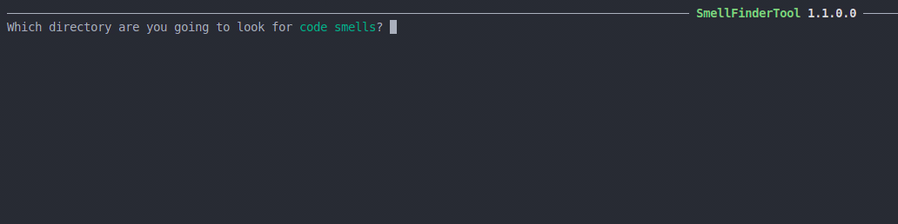
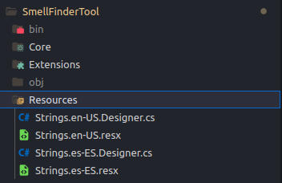
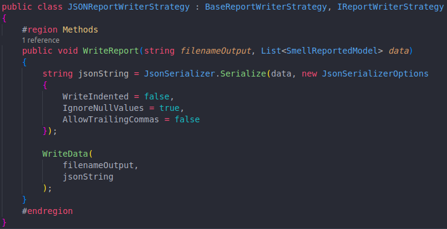

# CodeSmellFinder
*Searching bad smells!..*
## Introduction

CodeSmellFinder is a project developed in C# for the elective course [Programación Orientada a Objetos I](https://www.info.unlp.edu.ar/wp-content/uploads/2021/02/Taller-de-Programacion-Orientada-a-Objetos-1.pdf) in the *Licenciatura en Sistemas* program at the UNLP. It enables the detection and reporting of custom code smells in JavaScript by searching through each file in a directory specified by the user. We say these smells are custom because you write the rules for them by adding new visitors with the necessary logic. Take a look!

## Features

- Ease of adding new code smells.
- Integration with the Spectre Console tool for improved flow, readability, and a better user experience throughout the application.
- Globalization. Currently, only the Spanish and English languages have been added. The default language for the application is English.
- Ability to select the type of report to generate. Currently, there are 3 types: JSON, YAML, and plain text but is easily to extend that.

## Usage

```bash
# Easy! just run..
dotnet SmellFinderTool.dll
```

## Compatibility

CodeSmellFinder library target version:
 - dotnet core 3.1

CodeSmellFinder tool (console app):
 - dotnet core 3.1

## Step-by-step usage instructions



## How do I do that?

- **Adding visitors:** Every new visitor must inherit from the BaseVisitor class and provide a description, message (used in the report) and a name.
In addition, the corresponding method must be added according to the logic that you want to apply to detect a bad smell. There are several examples already developed within the application such as *ArrayInstanceVisitor*, *TernaryEvaluationVisitor*, etc.

- **Adding languages:** A text resource must be added with each value defined in the English language, which is the default in the app. For more details see the *Strings.es-ES.resx* file

    

- **Adding format of report:** A class must be created that inherits from the IReportWriterStrategy interface and the BaseReportWriterStrategy class, implementing what is necessary to be able to store the report in a new format. For example:

  

## Contributing

Want to help develop CodeSmellFinder project? Check out our [contribution guide](/CONTRIBUTING.md).

Issues should be issued at https://github.com/jmsolar/CodeSmellFinder/tree/testing-issue

## Aditional librarys used
*  Antlr4 tool https://github.com/antlr/antlr4
*  Antlr4 gramars https://github.com/antlr/grammars-v4/tree/master/javascript/javascript/CSharp
*  Spectre Console https://github.com/spectreconsole/spectre.console 
